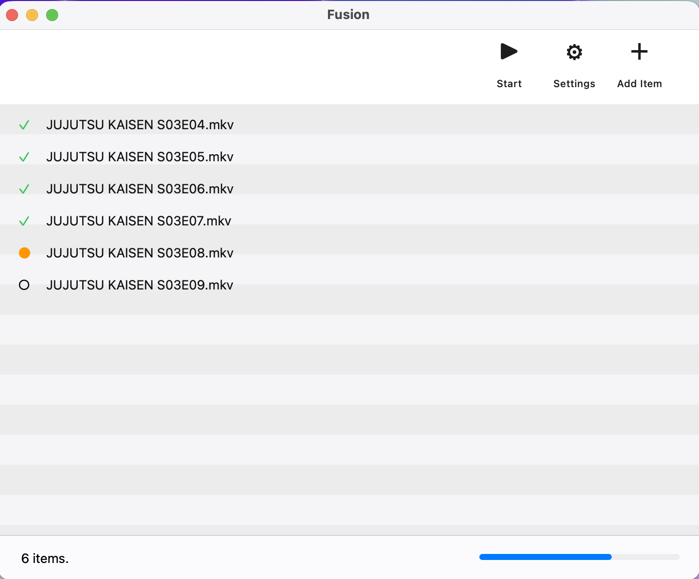
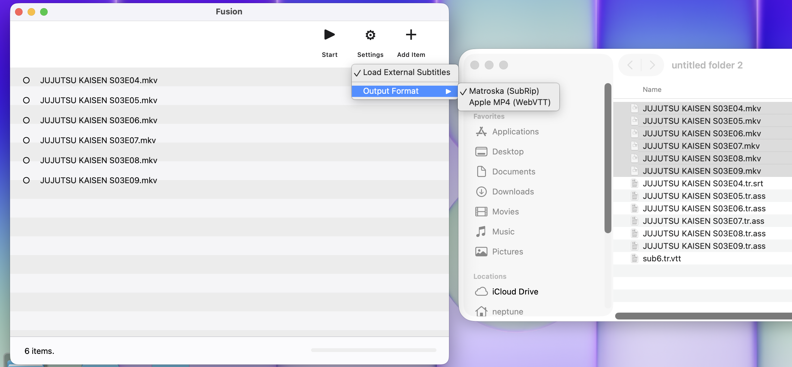
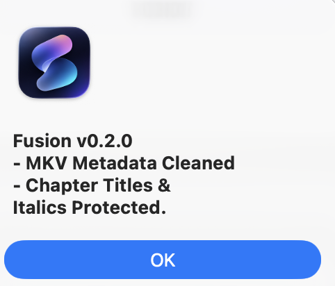
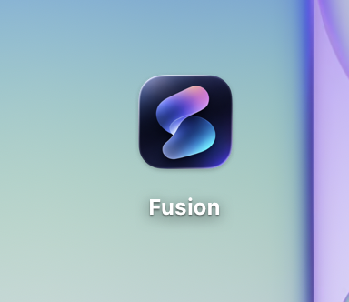
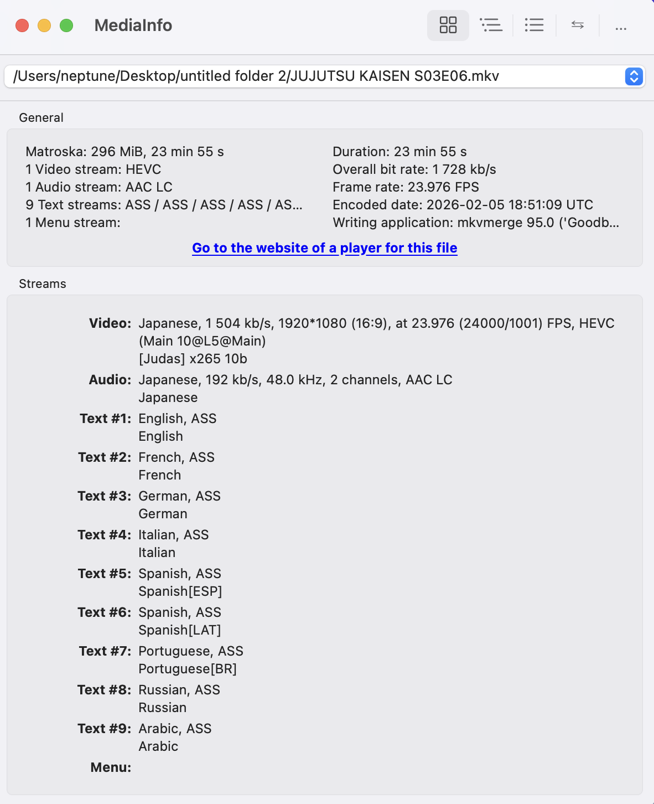
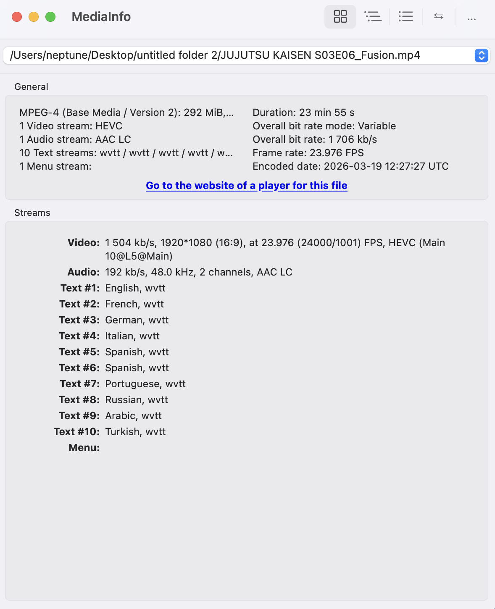
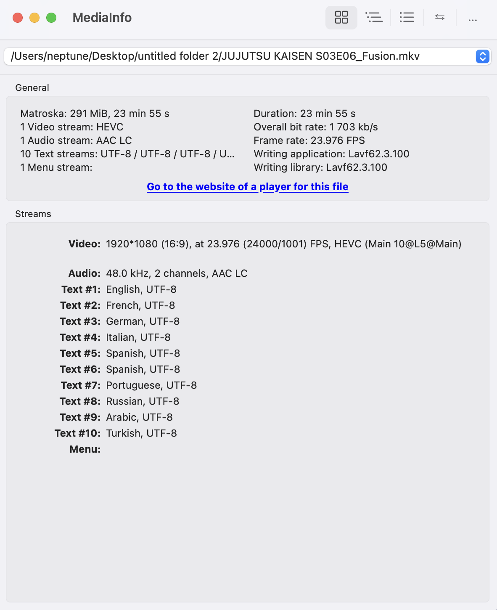

# 🌀 Fusion

**Fusion** is a streamlined macOS utility designed to optimize media containers for the Apple ecosystem (Infuse, Apple TV, and macOS). It focuses on standardizing subtitle formats and media streams to ensure perfect playback without quality loss.

---

## 📸 Screenshots & Workflow

### Application Interface

  
  

  
  

### Metadata & Subtitle Optimization (Before vs. After)

  
  
  

---

## 🎯 Who is Fusion For?

**Fusion** is crafted for media enthusiasts and high-fidelity collectors who demand a seamless, clutter-free viewing experience on Apple devices. It is the perfect tool for:

* **Apple TV & Infuse Power Users:** Specifically calibrated for the best performance on **Infuse (MKV recommended)** and **Apple TV (MP4 recommended)**.
* **The "One-Click" Efficiency Seekers:** If you want to bundle all your subtitles into a single, clean output file without navigating complex menus, Fusion is your shortcut.
* **Metadata Purists:** Tired of seeing "Encoded by [Random Site]" or annoying ad-titles in your media players? Fusion wipes the metadata slate clean, leaving only your content.
* **Subtitle Perfectionists:** * **MKV Lovers:** Automatically converts complex styles into the most compatible and lightweight **SRT** format.
    * **MP4/M4V Fans:** Seamlessly transforms subtitles into **WebVTT**, ensuring full compatibility with native Apple players.
    * **Italics Preservation:** Scans and converts hidden italic codes into proper tags, solving the "missing italics" issue in Infuse.
* **Automation Enthusiasts:** No more manual mapping. Fusion intelligently scans your folders, detects external `.srt` or `.ass` files with language codes, and merges them instantly.
* **Lossless Advocates:** Fusion performs **Remuxing**, not Transcoding. This means your video and audio quality remain 100% untouched while the processing happens in seconds.

---

## 🆕 What's New in v0.2.0

- **Matroska (SubRip) Support:** Enhanced MKV output format with specialized SubRip subtitle mapping.
- **Improved Chapter Preservation:** Refined logic to ensure chapter titles and markers remain intact during the remuxing process.
- **Stable Release:** Optimized internal processing workflows for faster and more reliable conversion.

---

## ✨ Key Features

### 🛡 Smart Subtitle Handling
- **Italics Preservation:** Automatically detects italic styles in ASS/SSA files and converts them into Infuse-compliant tags.
- **Clean Output:** Strips unnecessary styling and fonts to produce standardized, easy-to-read subtitle tracks.
- **Auto-Mapping:** Automatically pairs external files based on naming conventions and language suffixes.

### ⚡ Lossless Remuxing
- **No Quality Loss:** Copies original video (HEVC/H.264) and audio (Atmos/AAC/DTS) streams directly.
- **Metadata Integrity:** Removes unwanted global tags while keeping your chapters and audio language info.

###  Native macOS UI
- **Modern Design:** A clean PyQt6 interface with native macOS aesthetics.
- **Drag & Drop:** Simply drop your files into the app to start building your queue.
- **Batch Actions:** Manage multiple files at once with intuitive selection and a native menu bar.

---

## 🚀 How to Use

1. **Launch:** Open the Fusion app.
2. **Import:** Drag your video files into the window or click **"Add Item"**.
3. **Configure:** Choose your output format (**Matroska (SubRip)** or **Apple MP4**) from the **Settings** menu.
4. **Process:** Click **Start** to optimize your media in seconds.
5. **Clean Up:** Use the **Edit** menu to clear completed tasks or remove items from the list.

---

## ☕ Support the Project

If **Fusion** has saved you time and improved your media library, you can support its development through crypto. Every contribution helps keep the project alive and free!

### 💎 Crypto Donation (USDT - TRC20)
Using the **TRC-20** network ensures minimal transaction fees for you.

| Asset | Network | Wallet Address |
| :--- | :--- | :--- |
| **USDT** | **TRC-20** | `TMSDJybXZDnvgUhcjbLeAgD7eDP3wsXXNN` |

> **Note:** Please ensure you are using the **TRC-20 (Tron)** network before sending. 

---

*Optimized for high-fidelity media management on macOS.*
