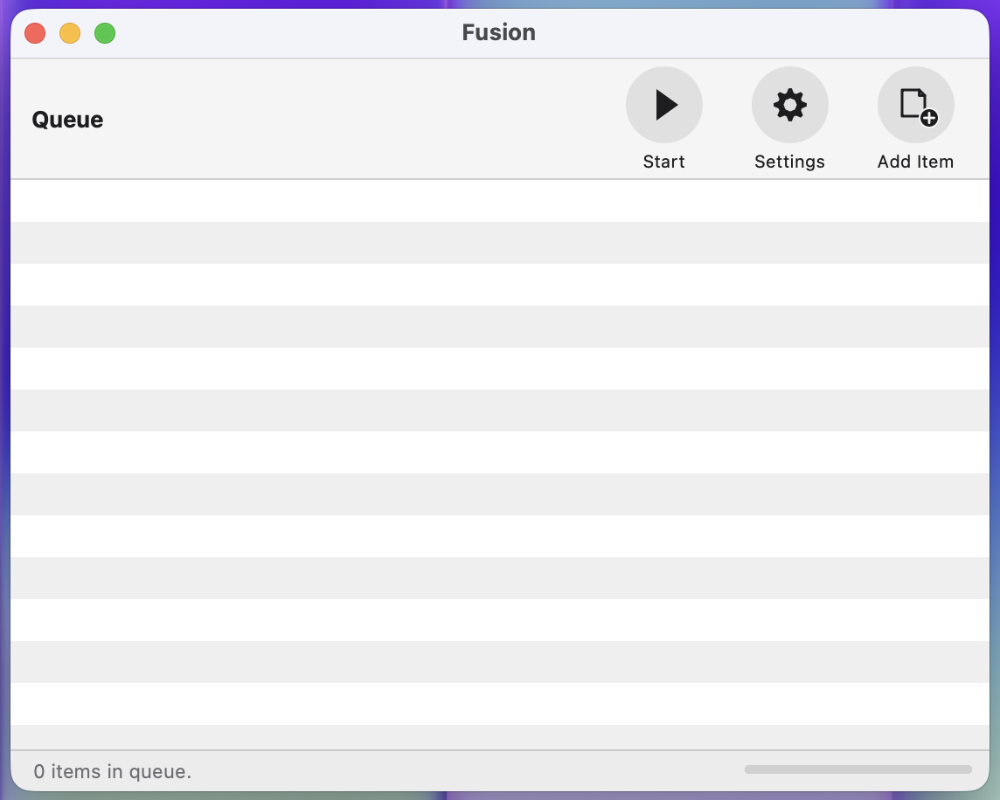
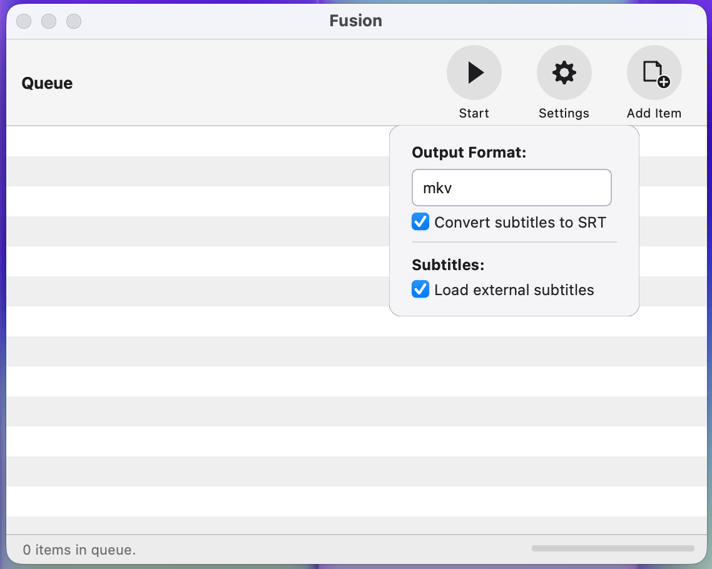

# 🌀 Fusion

**Fusion** is a streamlined macOS utility designed to optimize media containers for the Apple ecosystem (Infuse, Apple TV, and macOS). It focuses on standardizing subtitle formats and media streams to ensure perfect playback without quality loss.

---

## 📸 Screenshots & Workflow

### Application Interface

  
  

---

## 🆕 What's New in v0.3.0

- **Universal Binary Support:** Fusion is now fully compatible with both **Apple Silicon (M1/M2/M3/M4)** and **Intel-based Macs**. Internal tools are bundled as universal binaries for native performance.
- **Modern UI Redesign:** The interface has been completely rewritten with a focus on modern macOS aesthetics, featuring custom-drawn icons and a cleaner layout.
- **Flexible MKV Subtitle Mapping:** - Added a new **"Convert subtitles to SRT"** toggle for Matroska output.
    - When disabled, Fusion preserves original subtitle formats (e.g., ASS/SSA) and **keeps all embedded fonts (attachments)** intact.
    - When enabled, it standardizes subtitles to SubRip (SRT) for maximum compatibility.
- **Apple-Optimized MP4s:** Maintains mandatory **WebVTT (wvtt)** conversion for MP4 output to ensure 100% compatibility with native Apple players.
- **Enhanced Processing Logic:** Improved remuxing strategy that handles chapters and metadata more reliably while maintaining zero quality loss.

> **Note for Intel Mac Users:** As testing was primarily conducted on Apple Silicon, feedback from Intel Mac users is highly appreciated to ensure seamless performance.

---

## 🎯 Who is Fusion For?

* **Apple TV & Infuse Power Users:** Specifically calibrated for the best performance on **Infuse (MKV recommended)** and **Apple TV (MP4 recommended)**.
* **Lossless Advocates:** Fusion performs **Remuxing**, not Transcoding. Video and audio quality remain 100% untouched.
* **Subtitle Perfectionists:** Whether you want to preserve complex ASS styling with custom fonts in MKV or need clean WebVTT for native Apple playback.
* **Metadata Purists:** Automatically wipes cluttered metadata tags, leaving your library clean and professional.

---

## ✨ Key Features

### 🛡 Smart Subtitle Handling
- **Italics Preservation:** Automatically detects and converts italic styles in ASS/SSA files into Infuse-compliant tags.
- **Font Attachment Support:** Optionally keep embedded fonts in MKV files for perfect subtitle rendering.
- **Auto-Mapping:** Automatically pairs external `.srt` or `.ass` files based on naming conventions and language suffixes.

### ⚡ Technical Excellence
- **Zero Quality Loss:** Directly copies original video (HEVC/H.264) and audio (Atmos/AAC/DTS) streams.
- **Universal Performance:** Optimized for the latest macOS versions and both CPU architectures.

---

## 🚀 How to Use

1. **Launch:** Open the Fusion app.
2. **Import:** Drag your video files into the window or click **"Add Item"**.
3. **Configure:** Choose your output format and subtitle preferences in the **Settings** menu.
4. **Process:** Click **Start** to optimize your media in seconds.

---

## ☕ Support the Project

If **Fusion** has saved you time and improved your media library, you can support its development through crypto. Every contribution helps keep the project alive and free!

### 💎 Crypto Donation (USDT - TRC20)
Using the **TRC-20** network ensures minimal transaction fees for you.

| Asset | Network | Wallet Address |
| :--- | :--- | :--- |
| **USDT** | **TRC-20** | `TMSDJybXZDnvgUhcjbLeAgD7eDP3wsXXNN` |

---

*Optimized for high-fidelity media management on macOS.*
